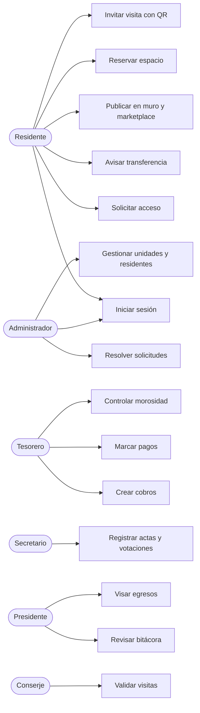
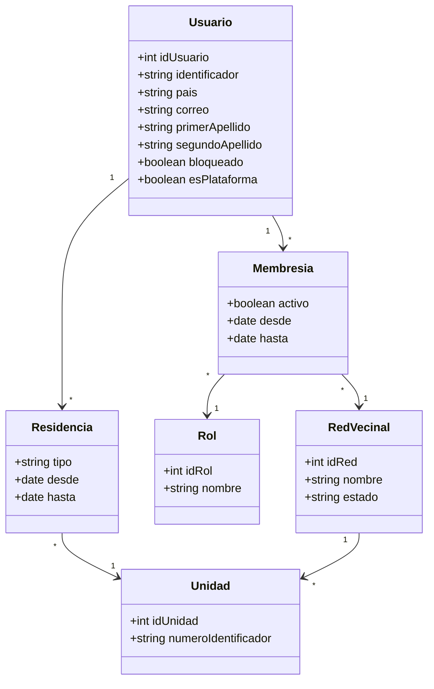
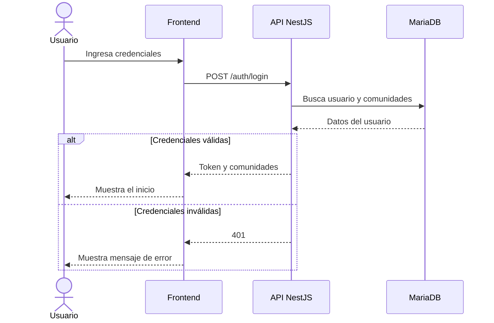
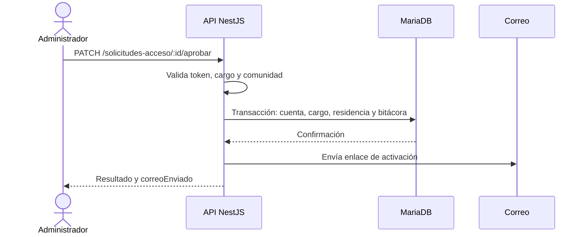
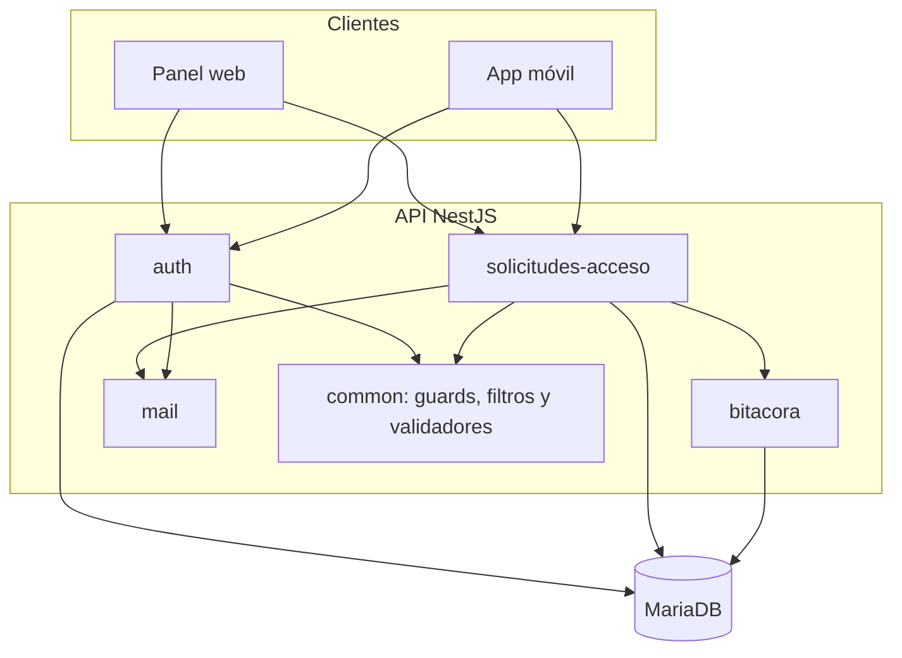

# Diagramas UML

## Casos de uso

```mermaid
flowchart LR
    R([Residente]) --> CU1[Solicitar acceso]
    R --> CU2[Iniciar sesión]
    R --> CU3[Avisar transferencia]
    R --> CU4[Publicar en muro y marketplace]
    R --> CU5[Reservar espacio]
    R --> CU6[Invitar visita con QR]
    A([Administrador]) --> CU2
    A --> CU7[Resolver solicitudes]
    A --> CU8[Gestionar unidades y residentes]
    T([Tesorero]) --> CU9[Crear cobros]
    T --> CU10[Marcar pagos]
    T --> CU11[Controlar morosidad]
    S([Secretario]) --> CU12[Registrar actas y votaciones]
    P([Presidente]) --> CU13[Revisar bitácora]
    P --> CU14[Visar egresos]
    C([Conserje]) --> CU15[Validar visitas]
```

## Clases

```mermaid
classDiagram
    class Usuario {
        +int idUsuario
        +string identificador
        +string pais
        +string correo
        +string primerApellido
        +string segundoApellido
        +boolean bloqueado
        +boolean esPlataforma
    }
    class RedVecinal {
        +int idRed
        +string nombre
        +string estado
    }
    class Unidad {
        +int idUnidad
        +string numeroIdentificador
    }
    class Rol {
        +int idRol
        +string nombre
    }
    class Membresia {
        +boolean activo
        +date desde
        +date hasta
    }
    class Residencia {
        +string tipo
        +date desde
        +date hasta
    }
    Usuario "1" --> "*" Membresia
    Membresia "*" --> "1" Rol
    Membresia "*" --> "1" RedVecinal
    Usuario "1" --> "*" Residencia
    Residencia "*" --> "1" Unidad
    RedVecinal "1" --> "*" Unidad
```

## Secuencia: inicio de sesión

```mermaid
sequenceDiagram
    actor U as Usuario
    participant F as Frontend
    participant A as API NestJS
    participant B as MariaDB
    U->>F: Ingresa credenciales
    F->>A: POST /auth/login
    A->>B: Busca usuario y comunidades
    B-->>A: Datos del usuario
    alt Credenciales válidas
        A-->>F: Token y comunidades
        F-->>U: Muestra el inicio
    else Credenciales inválidas
        A-->>F: 401
        F-->>U: Muestra mensaje de error
    end
```

## Secuencia: aprobación de solicitud

```mermaid
sequenceDiagram
    actor A as Administrador
    participant API as API NestJS
    participant B as MariaDB
    participant M as Correo
    A->>API: PATCH /solicitudes-acceso/:id/aprobar
    API->>API: Valida token, cargo y comunidad
    API->>B: Transacción: cuenta, cargo, residencia y bitácora
    B-->>API: Confirmación
    API->>M: Envía enlace de activación
    API-->>A: Resultado y correoEnviado
```

## Componentes

```mermaid
flowchart TB
    subgraph Clientes
        W[Panel web]
        M[App móvil]
    end
    subgraph API NestJS
        AU[auth]
        SO[solicitudes-acceso]
        BI[bitacora]
        MA[mail]
        CO[common: guards, filtros y validadores]
    end
    W --> AU
    W --> SO
    M --> AU
    M --> SO
    SO --> BI
    SO --> MA
    AU --> MA
    AU --> CO
    SO --> CO
    AU --> DB[(MariaDB)]
    SO --> DB
    BI --> DB
```
